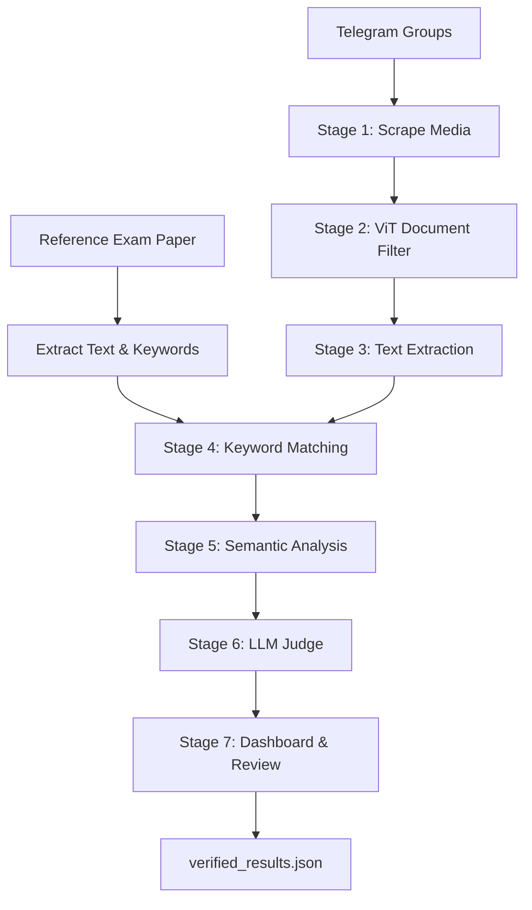

# Paper Leak Radar

Telegram exam paper leak detection system with a web dashboard for scanning, reviewing, and verifying flagged documents.

Given a **reference exam paper** (PDF or image), the pipeline monitors Telegram groups for circulating documents, compares candidates against the reference through multiple ML stages, and surfaces likely leaks for human review.

---

## How It Works

The system answers one question: *Is a document circulating on Telegram the same exam paper, or just similar study material?*

### End-to-end process

1. **Provide a reference paper** — the official exam paper you want to protect (upload via the web UI or pass a file path on the CLI).
2. **Scrape Telegram groups** — recent photos and PDFs are downloaded from configured channels/groups.
3. **Filter and compare** — each candidate passes through a multi-stage funnel (document classification → text extraction → keyword matching → semantic similarity → LLM verdict).
4. **Review results** — flagged documents appear in the dashboard with scores, matched snippets, and a verdict. A human reviewer confirms or rejects each hit.
5. **Export** — verified decisions are saved and can be exported for reporting.

### Detection funnel

Each stage removes unlikely candidates so expensive steps (embeddings, LLM) only run on promising files:

| Stage | Module | What it does |
|-------|--------|--------------|
| 1 | `telegram_scraper.py` | Downloads photos/PDFs from Telegram groups |
| 2 | `vit_filter.py` | Keeps document-like files (forms, questionnaires, reports) via a ViT classifier |
| 3 | `text_extractor.py` | Extracts text with PyMuPDF; falls back to Tesseract OCR for scans |
| 4 | `keyword_matcher.py` | Computes Jaccard keyword overlap against the reference; drops low matches |
| 5 | `semantic_analyzer.py` | Embeds full documents and text chunks with BGE; finds semantic similarity |
| 6 | `llm_judge.py` | Sends structured evidence to a local Ollama model for a final verdict |
| 7 | `report.py` | Writes `results.json` and serves the review dashboard |

### Verdict types

The LLM judge (or a rule-based fallback when Ollama is unavailable) assigns one of three labels:

| Verdict | Meaning |
|---------|---------|
| `LIKELY_LEAK` | Strong evidence the candidate is the same exam paper |
| `SIMILAR_TOPIC` | Same subject or syllabus, but not the same paper |
| `UNRELATED` | No meaningful match |

Human reviewers can override these in the dashboard as `CONFIRMED_LEAK`, `FALSE_POSITIVE`, or `NEEDS_REVIEW`.

---

## Architecture

```
┌─────────────────────────────────────────────────────────────────────────┐
│                         USER INTERFACES                                  │
│  CLI: main.py                    Web: report.py (FastAPI + Jinja2 UI)   │
└───────────────────────────────┬─────────────────────────────────────────┘
                                │
                                ▼
┌─────────────────────────────────────────────────────────────────────────┐
│                    7-STAGE DETECTION PIPELINE (main.py)                  │
│                                                                          │
│  [Reference Paper] ──► Text Extract ──► Keywords                        │
│                                                                          │
│  Stage 1: Telegram scrape  ──► downloaded_files/                        │
│  Stage 2: ViT filter       ──► document-type classification             │
│  Stage 3: Text extraction  ──► PyMuPDF + Tesseract OCR                  │
│  Stage 4: Keyword matching ──► Jaccard overlap filter                   │
│  Stage 5: Semantic analysis──► BGE embeddings + chunk similarity        │
│  Stage 6: LLM judge        ──► Ollama verdict (or rule fallback)        │
│  Stage 7: Dashboard          ──► results.json + human review            │
└───────────────────────────────┬─────────────────────────────────────────┘
                                │
                                ▼
┌─────────────────────────────────────────────────────────────────────────┐
│                         PERSISTENCE (file-based)                         │
│  results.json            Pipeline output (flagged candidates)            │
│  verified_results.json   Human review decisions                          │
│  pipeline.log            Run logs                                        │
│  *.session               Telegram auth session (gitignored)              │
└─────────────────────────────────────────────────────────────────────────┘
```



### Tech stack

| Layer | Technology |
|-------|------------|
| Language | Python 3 |
| Telegram | [Telethon](https://github.com/LonamiWebs/Telethon) |
| Vision / ML | PyTorch, Transformers, torchvision, Pillow |
| Embeddings | sentence-transformers (`BAAI/bge-small-en-v1.5`) |
| Document classifier | `HAMMALE/vit-tiny-classifier-rvlcdip` |
| PDF / OCR | PyMuPDF, pytesseract + Tesseract binary |
| LLM | [Ollama](https://ollama.com) (local, optional) |
| Web | FastAPI, Uvicorn, Jinja2 |

### External dependencies

- **Telegram API** — credentials from [my.telegram.org/apps](https://my.telegram.org/apps)
- **Hugging Face models** — ViT classifier and BGE embeddings download automatically on first run
- **Tesseract OCR** — required for scanned PDFs and images
- **Ollama** — optional; enables LLM judging (falls back to rule-based scoring without it)

---

## Prerequisites

- Python 3.10+ recommended
- [Tesseract OCR](https://github.com/tesseract-ocr/tesseract) installed and on your `PATH`
- Telegram API credentials ([my.telegram.org/apps](https://my.telegram.org/apps))
- (Recommended) [Ollama](https://ollama.com) running locally with the configured model

---

## Setup

### 1. Clone and install Python dependencies

```bash
git clone https://github.com/YOUR_USERNAME/paper-leak-radar.git
cd paper-leak-radar

python -m venv venv
venv\Scripts\activate        # Windows
# source venv/bin/activate   # macOS/Linux

pip install -r requirements.txt
```

### 2. Install system tools

**Tesseract** (for OCR on scanned documents):

- Windows: download from the [Tesseract releases page](https://github.com/UB-Mannheim/tesseract/wiki) and add to `PATH`
- macOS: `brew install tesseract`
- Linux: `sudo apt install tesseract-ocr`

**Ollama** (optional, for LLM judging):

```bash
# Install from https://ollama.com, then pull the default model:
ollama pull gemma3:4b
```

### 3. Configure Telegram credentials

```bash
copy .env.example .env   # Windows
# cp .env.example .env   # macOS/Linux
```

Edit `.env` with your values from [my.telegram.org/apps](https://my.telegram.org/apps):

```env
TELEGRAM_API_ID=your_api_id_here
TELEGRAM_API_HASH=your_api_hash_here
TELEGRAM_SESSION=leak_monitor_session
```

### 4. First-time Telegram login

Run the scraper once to authenticate with your phone number. A local `.session` file is created (gitignored):

```bash
python telegram_scraper.py IIT_JEE_Mains_Advance_Notes_pdf
```

### 5. Configure target groups

Edit `groups.txt` with Telegram usernames, one per line (`#` for comments):

```
IIT_JEE_Mains_Advance_Notes_pdf
# another_group_username
```

---

## Running the System

### Option A — Web dashboard (recommended)

Start the control center and open it in your browser:

```bash
python report.py
```

Open [http://127.0.0.1:8000](http://127.0.0.1:8000)

From the dashboard you can:

- Upload a reference exam paper
- Edit the list of Telegram groups to monitor
- Start a scan and watch live progress
- Review flagged documents side-by-side with matched snippets
- Mark results as confirmed leak, false positive, or needs review
- Export verified reports

### Option B — CLI pipeline

Run the full pipeline from the command line:

```bash
python main.py --reference path/to/paper.pdf --groups groups.txt
```

This runs all six detection stages, saves results to `results.json`, and automatically launches the review dashboard when finished.

**Additional CLI options:**

```bash
# Skip launching the dashboard after the pipeline completes
python main.py --reference paper.pdf --groups groups.txt --no-dashboard

# Custom keyword threshold and exam metadata (used by the LLM judge)
python main.py --reference paper.pdf --groups groups.txt \
  --threshold 0.30 \
  --subject "Physics JEE Mains" \
  --year 2024 \
  --board NTA

# Pass groups directly instead of a file
python main.py --reference paper.pdf --groups "group1,group2"
```

### Testing individual stages

Each pipeline stage can be run independently for debugging:

```bash
python telegram_scraper.py <group1> <group2>   # scrape only
python vit_filter.py <file>                     # test document classification
python text_extractor.py <file>                 # test text/OCR extraction
```

---

## Configuration

### Environment variables (`.env`)

| Variable | Required | Default | Description |
|----------|----------|---------|-------------|
| `TELEGRAM_API_ID` | Yes | — | Telegram app ID |
| `TELEGRAM_API_HASH` | Yes | — | Telegram app hash |
| `TELEGRAM_SESSION` | No | `leak_monitor_session` | Telethon session filename |

### Pipeline settings (`config.py`)

| Setting | Default | Description |
|---------|---------|-------------|
| `KEYWORD_THRESHOLD` | `0.30` | Minimum Jaccard overlap to pass Stage 4 |
| `SEMANTIC_THRESHOLD` | `0.70` | Cosine similarity for semantic closeness |
| `OLLAMA_MODEL` | `gemma3:4b` | Local LLM model name |
| `OLLAMA_HOST` | `http://localhost:11434` | Ollama server URL |
| `MAX_MESSAGES_PER_GROUP` | `50` | Messages scanned per group |
| `MAX_MEDIA_DOWNLOADS_PER_GROUP` | `10` | Media files downloaded per group |
| `TESSERACT_LANG` | `eng` | OCR language (`eng+hin` for Hindi) |
| `REPORT_HOST` / `REPORT_PORT` | `127.0.0.1:8000` | Dashboard bind address |

---

## Web API

The dashboard exposes a REST API for programmatic use:

| Endpoint | Method | Description |
|----------|--------|-------------|
| `/` | GET | Dashboard UI |
| `/api/results` | GET | Latest flagged results |
| `/api/groups` | GET | Current Telegram group list |
| `/api/groups` | POST | Update group list |
| `/api/upload-reference` | POST | Upload a reference paper |
| `/api/start-scan` | POST | Start an asynchronous scan |
| `/api/scan-status` | GET | Live scan progress and logs |
| `/api/verify/{result_id}` | POST | Submit a human verification |
| `/api/summary` | GET | Aggregate stats |
| `/api/export` | GET | Export verified results |

---

## Project Structure

```
paper-leak-radar/
├── config.py              # Shared settings (thresholds, models, paths)
├── main.py                # CLI pipeline orchestrator (Stages 1–6)
├── report.py              # FastAPI web dashboard (Stage 7)
├── telegram_scraper.py    # Stage 1: Telegram media download
├── vit_filter.py          # Stage 2: ViT document classification
├── text_extractor.py      # Stage 3: PDF text + OCR fallback
├── keyword_matcher.py     # Stage 4: Keyword overlap scoring
├── semantic_analyzer.py   # Stage 5: BGE embedding similarity
├── llm_judge.py           # Stage 6: Ollama verdict (rule fallback)
├── templates/
│   └── report.html        # Dashboard frontend
├── groups.txt             # Default Telegram targets
├── .env.example           # Credential template
├── requirements.txt       # Python dependencies
│
│  Runtime artifacts (gitignored):
├── downloaded_files/      # Scraped Telegram media
├── uploaded_references/   # Reference papers uploaded via UI
├── results.json           # Latest pipeline output
├── verified_results.json  # Human review decisions
├── pipeline.log           # Pipeline run log
└── *.session              # Telegram auth session
```

---

## Troubleshooting

| Problem | Fix |
|---------|-----|
| `Telegram API credentials are not configured` | Copy `.env.example` to `.env` and fill in your API ID and hash |
| No files downloaded | Verify group usernames in `groups.txt`, confirm Telegram login (`.session` exists), and check you have access to the groups |
| Empty text from PDFs | Install Tesseract and ensure it is on your `PATH`; set `TESSERACT_LANG` in `config.py` if needed |
| LLM judge uses rule fallback | Start Ollama and pull the model: `ollama pull gemma3:4b` |
| Slow first run | Hugging Face models (ViT + BGE) download on first use — needs network and ~500 MB disk |
| Scan is slow | Defaults cap messages and downloads per group for demo speed; adjust `MAX_MESSAGES_PER_GROUP` and `MAX_MEDIA_DOWNLOADS_PER_GROUP` in `config.py` |

---

## License

See [LICENSE](LICENSE).
